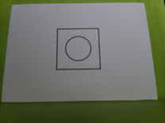
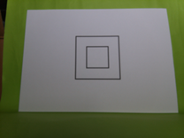
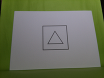
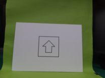

# aitrios-rpi-dataset-sample

## Notice

### Security

Please read the Site Policy of GitHub and understand the usage conditions.

## Overview

`aitrios-rpi-dataset-sample` is a simple, easy to try, privacy-free dataset for functionality test of AI model on edge AI devices.
[PDF file](modelzoo_shapes.pdf) is provided to try inference on your environment.

Currently, the dataset supports classification, object detection, semantic segmentation, and pose estimation tasks.

## Description

Card dataset contains 516 images (216 for training, 300 for validation) of printed simple geometric shape (circle, triangle, rectangle).

Arrow dataset contains 525 images (132 for training, 393 for validation) of printed arrow shape.

## License
This project is licensed under the [Creative Commons Attribution 4.0 International License](LICENSE.md).